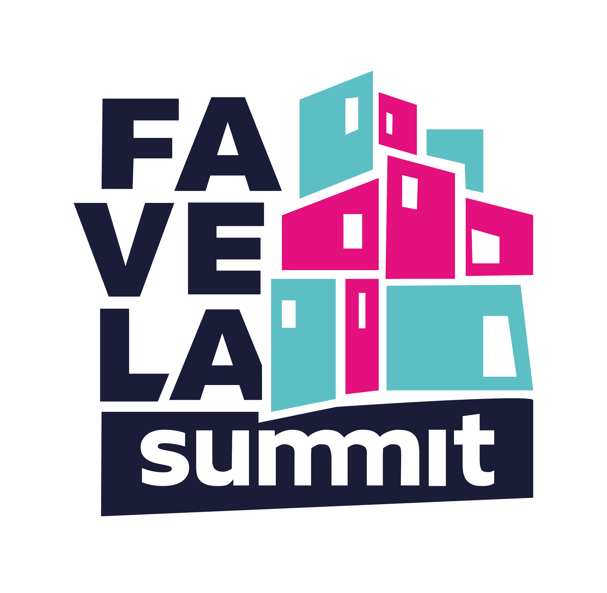

# Projeto final {reprograma} - Favela Summit

<div align="center">
  
</div>
<p align="justify">
  
O [Favela Summit](https://favelasummit.com/index) é uma iniciativa que visa aumentar o potencial das favelas brasileiras de empreender, conectando seus moradores a empresas de destaque. Inspirados na história de sucesso de nosso cofundador, que nasceu e cresceu em uma favela do Rio de Janeiro e hoje é investidor e intraempreendedor, acreditamos que oportunidades de qualificação podem transformar vidas.

No ano de 2022 o Favela Summit teve seu foco em projetos Educação e Empregabilidade nas comunidades. Com isto, nossos parceiros se concentraram na área de cursos profissionalizantes, em especial nas áreas de tecnologia, além de mentorias e consultorias para projetos sociais e pequenos negócios.

  </p>
  
## Proposta
A proposta deste projeto é fazer um banco vagas de emprego na área de tecnologia para parceiros do Favela Summit, ligando assim as empresas aos estudantes.  Além da maior facilidade em conseguir pessoas qualidades, as empresas receberiam incentivos para contratação de pessoas iniciantes e preenchimento da vaga de forma simples e eficiente.

Nesta versão inicial do projeto é possivel:
<<<<<<< HEAD

=======

> > > > > > > beff3598088aeb309b6ac8aa5067ae9537dea9de

- Cadastrar empresas;
- Cadastrar estudantes;
- Listar empresas cadatrados;
- Listar candidatos cadastrados;
- Publicar vagas de emprego;
- Deletar vaga de emprego publicada;
- Finalizar vaga;
- Dar cashback para vagas finalizadas com candidatos junior;
- Alterar o estatus da vaga;
- Se candidatar a vagas de emprego;
- Remover candidatura;
- Salvar vagas de emprego;
- Consultar vagas salvas;

# <<<<<<< HEAD

> > > > > > > beff3598088aeb309b6ac8aa5067ae9537dea9de

## Iniciando o projeto

Install project with npm

```bash
git clone https://github.com/annaberto/projeto-final-imersao-js.git
```

```
npm install
```

```
cd index/index.js
```

## Rodando testes

To run tests, run the following command

```bash
  npm run test
```

## Lições aprendidas

Esse projeto é um trabalho final de um curso de 12 semanas feito por e para mulheres que trouxeram tópicos importantes de conhecimentos técnicos e também aprendizado de habilidades comportamentais que são fundamentais para as atividades profissionais.

Assuntos técnicos abordados durante o curso: Programação orientada a objetos, , TDD, Prototype, Refatoracão, Clean Code e SOLID

<<<<<<< HEAD
Sou muito grata por ter partilhado meus dias e novos aprendizados ao lado de mulheres incríveis, que assim como eu tiveram que ter muita força e determinação para conclusão deste curso maravilhoso.
=======
Sou muito grata por ter partilhado meus dias e novos aprendizados ao lado de mulheres incríveis, que assim como eu tiveram que ter muita força e determinação para conclusão deste curso maravilhoso.

> > > > > > > beff3598088aeb309b6ac8aa5067ae9537dea9de

## Authors

<div> 
  <a href="https://www.linkedin.com/in/annaberto" target="_blank"></a>   
  <a href = "https://github.com/annaberto"></a>
  <a href = "mailto:raphaelaberto@gmail.com"></a>
<<<<<<< HEAD
=======

> > > > > > > beff3598088aeb309b6ac8aa5067ae9537dea9de
